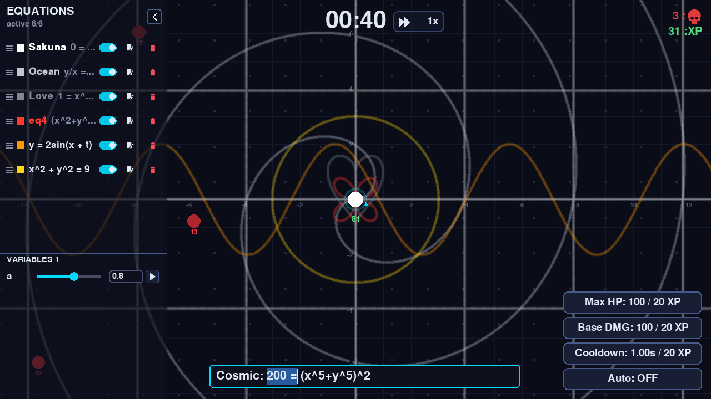
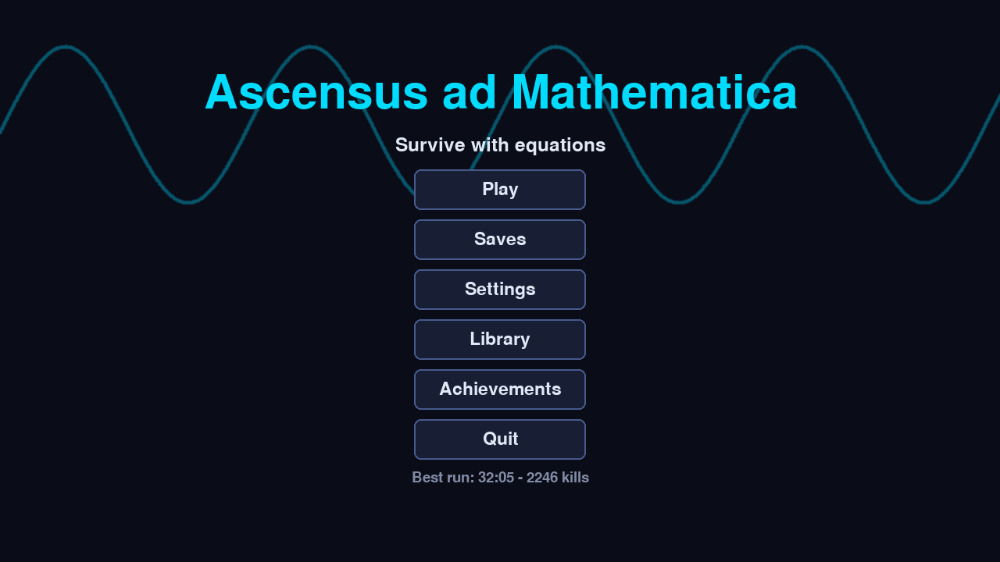
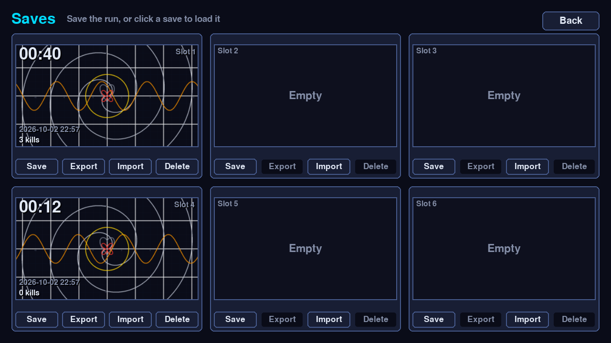
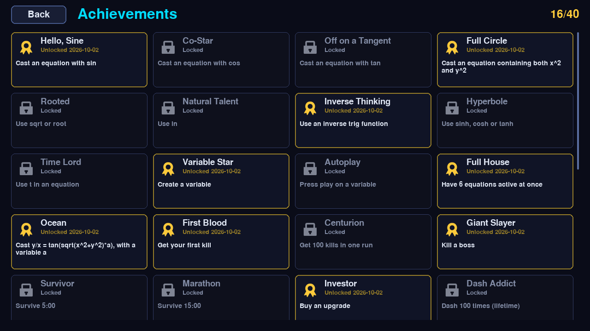
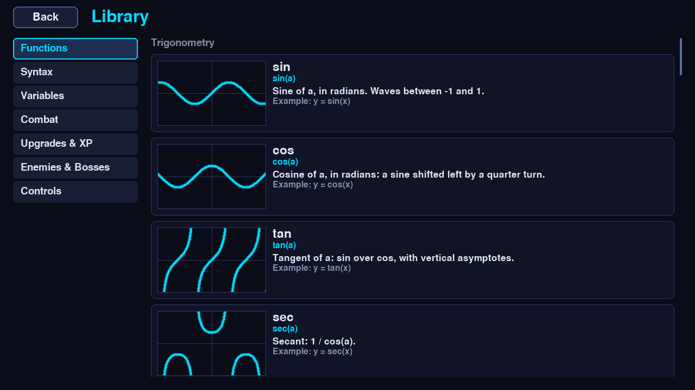
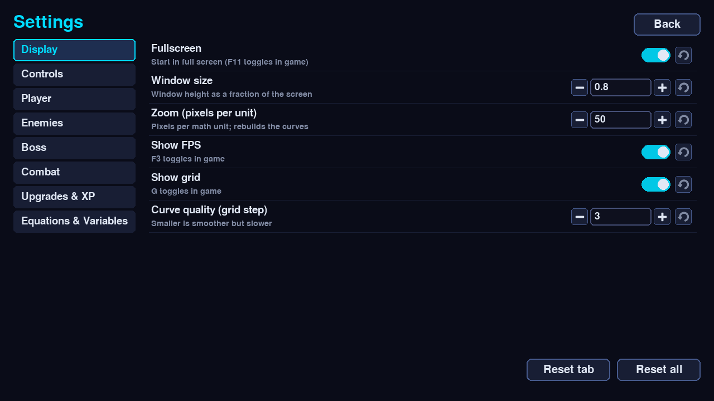

# Ascensus ad Mathematica

A fun free survival game where the magic is math equations.

[](https://github.com/UncertaintyNihilityOmega/Ascensus-ad-Mathematica/actions/workflows/tests.yml)
[](LICENSE)


You stand at the origin of a coordinate plane while enemies close in from every side. Your only weapons
are the equations you type: every curve you cast is drawn across the screen and pulses damage into
everything it touches. Kills give XP, XP buys upgrades, and a boss arrives every five minutes.



## Features

- **Type any curve.** `y = sin(x)`, `x^2 + y^2 = 9`, `tan(sqrt(x^2+y^2)) = y/x`, with 30+ functions, implicit
  multiplication and named equations (`eq4: (x^2+y^2)^3 = 4x^2 y^2`).
- **Variables with sliders.** Any letter becomes a variable: drag it, type it, or press play to animate the curve.
- **Real roguelite loop.** Six active equations, XP upgrades (Max HP, Base DMG, Cooldown, Auto), bosses,
  dash, 1x / 2x / 3x game speed, WASD or mouse movement.
- **40 achievements**, including equation shapes to discover (*Sakuna*, *Ocean*, *Love is Endless*, ...).
- **Six save slots** with thumbnails, an autosave with **Continue**, and portable `.ascensus` files to
  export and import runs.
- **Library** of every function with a live mini graph, and a **Settings** page for every game number.

| Menu | Saves | Achievements |
|---|---|---|
|  |  |  |
| **Library** | **Settings** | |
|  |  | |

## Quick start (Windows)

1. Install [Python 3.13 or newer](https://www.python.org/downloads/) (tick "Add python.exe to PATH").
2. Download this repository (green **Code** button, **Download ZIP**) and unzip it.
3. Double-click **`tools\setup.bat`**. It needs the internet once: it creates a private Python environment,
   installs the game and puts an **Ascensus ad Mathematica** shortcut in the folder and on your Desktop.
4. Play with the shortcut.

On macOS or Linux, or if you prefer the terminal:

```bash
python -m venv .venv
.venv/bin/python -m pip install -e .        # Windows: .venv\Scripts\python -m pip install -e .
.venv/bin/python -m ascensus                # or simply: .venv/bin/ascensus
```

## How to play

| Input | Effect |
|---|---|
| **Enter** or click the box | Type an equation (time slows to 20 % while you type) |
| **Enter** while typing | Cast it. A red message explains anything that can't be read |
| WASD / arrow keys | Move (WASD mode). Settings > Controls switches to **mouse mode**: walk toward the cursor, right-click to dash |
| **J** (rebindable) | Dash in the direction you are moving (invulnerable while dashing) |
| Mouse in the equation box | Click to place the cursor, drag or Shift+click to select, double-click selects a word |
| Ctrl+C / X / V / A, Ctrl+Z | Copy, cut, paste, select all in the box; Ctrl+Z (not typing) undoes a deleted equation |
| **1x** button next to the timer | Cycle the game speed 1x / 2x / 3x |
| Esc | Cancel typing, or pause (Resume, Stats, Saves, Settings, Library, Main Menu) |
| G / F3 / F11 | Grid and axes / FPS readout / full screen or window |

**Combat.** The first six enabled equations in the sidebar are active and pulse once per cooldown (1 s at
first). A pulse deals `Base DMG x 4 / L` to every enemy on the curve, where `L` is the curve's visible
length: short, precise curves hit hard, screen-filling ones are gentle. Enemies give XP worth half their
HP; spend it in the bottom-right panel, or switch on **Auto** to always buy the cheapest upgrade.

**Sidebar.** Drag equations to reorder them, switch them on and off, edit or delete them (with undo), and
click the colour swatch for 20 colours plus a custom picker. The **VARIABLES** section appears as soon as
an equation uses a variable.

## Equation guide

- **Names:** `x`, `y`, `t` (game seconds), `pi`, `e`. Any other letter, or a letter with a subscript like
  `a_1`, is a variable that starts at 1. `ab` means `a*b`.
- **Operators:** `+ - * / % ^`, parentheses and implicit multiplication: `2x`, `3sin(x)`, `(x+1)(x-1)`.
- **Functions:** `sin cos tan sec csc cot`, `asin acos atan asec acsc acot` (also `arcsin`, ...),
  `sinh cosh tanh asinh acosh atanh`, `sqrt cbrt abs sign floor ceil round exp ln log log2`, and two-argument
  `min max mod hypot atan2 root(n, x) log(base, x)`.
- **What gets drawn:** `x^2` means `y = x^2`; an expression with `y` but no `=` means `expr = 0`; with one `=`,
  both sides are compared: `x = 2`, `1 = x^2 + y^2`.
- **Names for equations:** `eq4: ...` shows `eq4` in the sidebar. Names must be unique.
- **Try these:** `y = a*sin(x + t)`, `x^2 + y^2 = (t % 5)^2`, `0 = sin(x*a)*sin(y*a)`, `1 = x^2+(y-sqrt(abs(x)))^2`.

## Saves and files

Everything is stored in the `save/` folder next to the game (it is not part of the repository):
`settings.json`, `profile.json` (best run and achievements) and `slots/` (the six slots and the autosave).
**Export** on a slot writes a single `.ascensus` file you can share; **Import** loads one into any slot.
Delete a file to reset it.

## For developers

```bash
python -m pip install -e ".[dev]"
python -m pytest                    # 700+ unit tests, headless
python tools/smoke.py               # plays the game headless at 1280x720 and 1920x1080, prints frame times
python tools/screenshots.py         # re-renders the images in docs/images/
```

Set `ASCENSUS_PERF_GATE=1` to make `smoke.py` fail on slow frames (off by default because timings depend on
the machine). The tests never touch your real `save/` folder.

```
ascensus/
  core/       equation parser, curve engine (root finding + marching-squares lines), equations, variables
  game/       player, enemies, upgrades, controls, save games, profile, achievements, stats
  scenes/     menu, game, game over and the pages (settings, library, achievements, saves, stats)
  ui/         widgets, sidebar, equation box, colour picker, icons, file dialogs, layout
  data/       Library texts
  assets/     app icon and Kenney icons
  config.py   every tunable number (most are editable in Settings)
tests/        pytest suite
tools/        setup, smoke run, screenshots, icon and shortcut scripts
docs/         README images and the development notes the game was planned with
```

Contributions are welcome; see [CONTRIBUTING.md](CONTRIBUTING.md) and the [changelog](CHANGELOG.md).

## Credits and license

Made by Uncertainty Omega. The game is released into the public domain under the [Unlicense](LICENSE).

- Icons in `ascensus/assets/icons/` are from [Kenney](https://kenney.nl) (Game Icons, Board Game Icons),
  CC0 1.0 public domain; see `ascensus/assets/icons/License.txt`. Other icons are drawn in code.
- Text uses the font that ships with pygame. The dependencies, [pygame-ce](https://pyga.me) (LGPL) and
  [NumPy](https://numpy.org) (BSD), are installed by pip and are not part of this repository.
